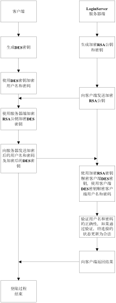

## RSA

请见grsa.h。RSA公钥加密算法是一种非对称密码算法，所谓非对称，就是指该算法需要一对密钥，使用其中一个加密，则需要用另一个才能解密。它在1977年由Ron
Rivest、Adi
Shamirh和LenAdleman在（美国麻省理工学院）开发的。RSA取名来自开发他们三者的名字。RSA是目前最有影响力的公钥加密算法。它是第一个既能用于数据加密也能用于数字签名的算法。

RSA的特点是：产生密钥麻烦；运算代价很高，速度很慢，较DES慢几个数量级；

```cpp
//Example
#include “gdes.h”
CGRsa rsa;

unsigned char src[1024];//编码前的原文
memset(src, 'A', 1024);
unsigned char en[2048];//编码后的密文
unsigned char de[1024];//解码后的原文

RSAContext* pContext = rsa.RSANew();
rsa.RSAGenKeyPair(pContext);
int outlen = rsa.RSAPubEncrypt(pContext, 1024, src, en);//返回编码后的长度
int in2len = rsa.RSAPrivDecrypt(pContext, outlen, en, de);//返回解码后的长度
```

应用场景：

网络游戏登陆流程


